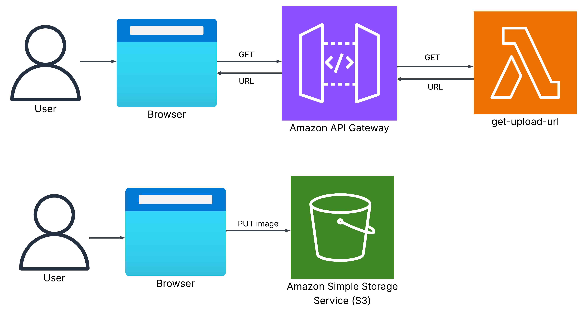
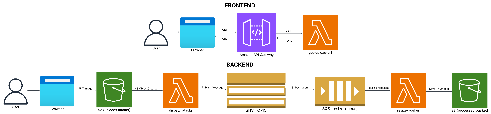
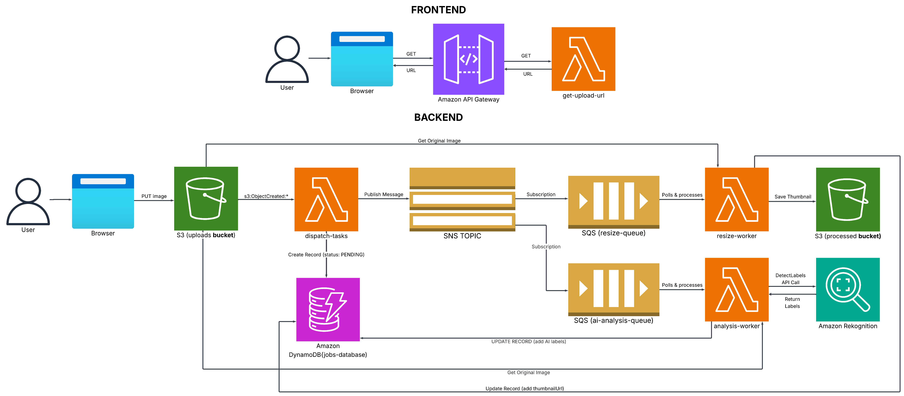

Pixel-Pipe: An AI-Powered Media Analysis Platform built on a serverless, event-driven architecture with AWS and Terraform.

Pixel-Pipe is an architectural showcase of a modern, cloud-native application designed for resilience, scalability, and automation. It's an AI-powered media analysis platform that ingests images and processes them through a fully decoupled, event-driven pipeline on AWS using services like S3, Lambda, SQS, and SNS. The entire system, from the network to the application logic, is defined with Infrastructure as Code (Terraform) and deployed via a secure, automated CI/CD workflow, demonstrating a holistic approach to building and managing production-grade software.

## V1 Architecture

## V2 Architecture: The Event-Driven Pipeline

The V2 architecture introduces the core asynchronous processing pipeline. Once an image is uploaded, an S3 event triggers a `dispatch-tasks` Lambda. This function publishes a message to an SNS topic, enabling a "fan-out" pattern for future workers. For now, a single SQS queue subscribes to this topic, holding jobs for the `resize-worker` Lambda. This decouples the initial upload from the processing, creating a resilient and scalable backend system.

## V3 Architecture: AI Integration & State Management

The V3 architecture completes the core processing pipeline by introducing AI analysis and a persistent data layer. The SNS topic now fans out to a second **`ai-analysis-queue`**, allowing image resizing and AI analysis to happen in parallel.

A new `analysis-worker` Lambda consumes from this queue, calling **Amazon Rekognition** to perform object detection. Crucially, a **DynamoDB** table (`jobs-database`) has been introduced as a central state machine. The `dispatch-tasks` Lambda creates an initial record for each job, and each worker Lambda then updates that same record with its results (e.g., thumbnail URL, AI labels), providing a full audit trail for each step of the asynchronous process.

